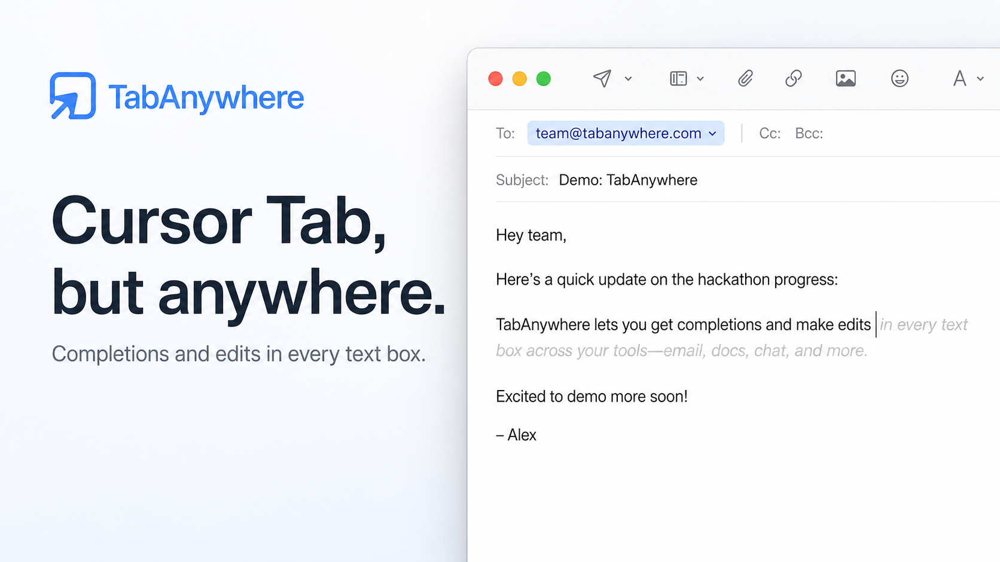

# Tab Anywhere



Cursor Tab, but for every text field on your Mac.

Tab Anywhere is a local-first macOS assistant that provides system-wide inline completions and edit predictions. It works across ordinary input fields, using the current text, cursor position, app context, and optional screenshot-derived scene memory to suggest what should come next.

## Development

```bash
swift run TabAnywhere
```
