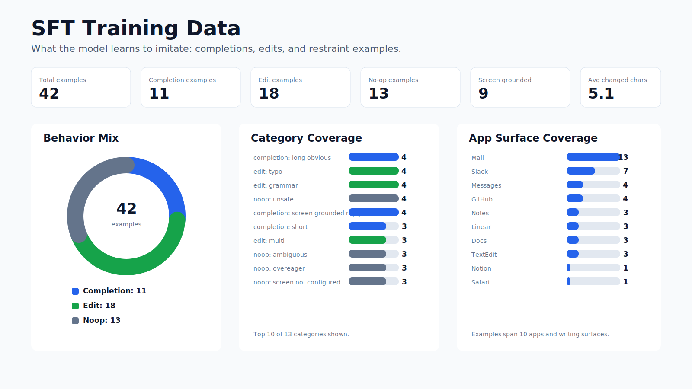
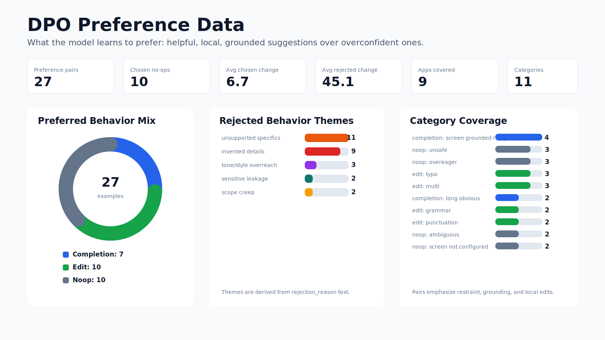

# Training Data Visualizations

These visuals summarize the current TabAnywhere fine-tuning datasets.

Each visualization is available as both SVG and PNG under `docs/assets/`.

## SFT Data

The SFT dataset teaches the model what good rewritten text windows look like:
short completions, longer obvious completions, local edits, and no-op cases.

## DPO Data

The DPO dataset teaches preference: choose the helpful, grounded, restrained
prediction over the overconfident, invented, or overly broad one.

